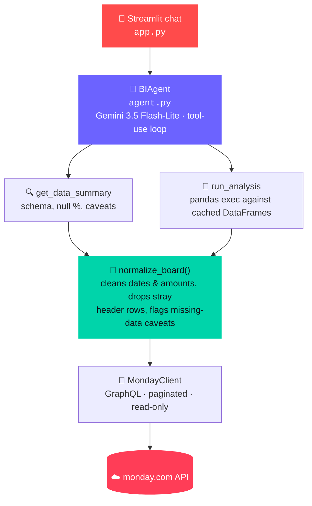

<div align="center">

# 🛸 Skylark BI Agent

### Conversational business intelligence over live monday.com data

_No hardcoded CSVs. No stale exports. Just ask._

[](https://www.python.org/)
[](https://streamlit.io/)
[](https://aistudio.google.com/)
[](https://developer.monday.com/)
[]()

</div>

---

> **What this is:** a chat agent that answers founder-level questions —
> *"How's our pipeline looking for the energy sector this quarter?"* —
> by querying two **live** monday.com boards (Work Orders, Deals),
> cleaning genuinely messy real-world data on the fly, and reasoning
> over it with an LLM tool-use loop. Nothing is pre-baked from the
> sample CSVs; every answer is computed at query time.

📄 See [`DECISION_LOG.md`](./DECISION_LOG.md) for assumptions,
trade-offs, and interpretation notes (required deliverable for this
assignment).

## 📚 Contents

- [Architecture](#-architecture)
- [Setup](#-setup)
- [Known data-quality behaviors](#-known-data-quality-behaviors)
- [Files](#-files)
- [Limitations](#-limitations--not-production-hardened)

## 🏗️ Architecture



Runs on **Google Gemini's free tier** (Gemini 3.5 Flash-Lite, via its
OpenAI-compatible endpoint) — no cost to run or demo. The project
started on Groq (Llama 3.3 70B) and switched mid-build after hitting
Groq's daily token cap during testing; Gemini's free tier gives more
daily headroom for a tool-use loop that replays conversation history
each turn. See the Decision Log for the full reasoning. Swapping to a
different provider (Anthropic, OpenAI, Groq) later only touches
`agent.py`'s client setup — six lines, all constants — since the
tool-use loop is standard OpenAI-style function calling.

> **Why this shape?** Rather than hand-coding a query for every
> possible founder question ("pipeline by sector", "revenue this
> quarter", "which deals are stuck"), the agent gets `pandas`-level
> access to the cleaned data and writes its own analysis code per
> question. This covers open-ended and cross-board questions without
> a combinatorial explosion of bespoke query functions.
> `get_data_summary` is called first so the model always analyzes real
> column names and real null rates instead of guessing.

Boards are fetched once per session and cached in memory; the sidebar
**"Refresh data"** button clears the cache for fresh pulls.

## ⚙️ Setup

### 1️⃣ Import the data into monday.com

Create two boards from the provided CSVs (or the Google Sheets in the
assignment): **Work Orders** and **Deals**. Column types don't need
to be perfect — the agent treats every column as text and normalizes
dates/amounts itself, so it's tolerant of "Text" columns instead of
native Date/Number columns.

### 2️⃣ Get your API keys

| Key | Where to get it |
|---|---|
| 🔑 **Gemini API key** *(free, no card)* | [aistudio.google.com](https://aistudio.google.com) → sign in → Get API Key → create key. Powers the agent's reasoning (Gemini 3.5 Flash-Lite) at zero cost. |
| 🔑 **monday.com token** | monday.com → avatar (bottom-left) → **Developers** → **My access tokens** |
| 🔢 **Board IDs** | Open each board, copy just the number from the URL — `monday.com/boards/<BOARD_ID>` → use `<BOARD_ID>`, not the full URL |

### 3️⃣ Configure environment

```bash
cp .env.example .env
# fill in GEMINI_API_KEY, MONDAY_API_TOKEN,
# MONDAY_WORK_ORDERS_BOARD_ID, MONDAY_DEALS_BOARD_ID
```

### 4️⃣ Run locally

```bash
pip install -r requirements.txt
cd src
streamlit run app.py
```

### 5️⃣ Deploy (hosted deliverable)

Push this repo to GitHub and deploy on [Streamlit Community
Cloud](https://streamlit.io/cloud) (free): set the four secrets above
in the app's Secrets manager, set the main file path to `src/app.py`.

## 🧹 Known data-quality behaviors

| Behavior | Handling |
|---|---|
| **Pasted header rows** | Rows where a cell duplicates its own column header are detected and dropped during normalization |
| **Heavy missing data** | Columns with >40% missing values are surfaced to the model as caveats — it's instructed to mention them when relevant rather than silently treating blanks as zero |
| **Masked currency fields** | Stripped of non-numeric characters and coerced to numeric; unparseable values become `NaN`, never `0` |
| **No literal "Energy" sector** | Closest match in the sample data is **Renewables**. Not hardcoded — the agent discovers real sector values via `get_data_summary` and asks for clarification or states the mapping it used |

## 📁 Files

| File | Purpose |
|---|---|
| `src/app.py` | Streamlit chat UI |
| `src/agent.py` | Gemini tool-use loop, system prompt, tool implementations |
| `src/monday_client.py` | Read-only monday.com GraphQL client with pagination |
| `src/normalize.py` | Cleans raw board data into pandas DataFrames + caveats |

## ⚠️ Limitations / not production-hardened

`run_analysis` executes model-generated Python via `exec()` against
in-memory DataFrames. That's appropriate for a single-tenant,
founder-facing internal tool talking to a read-only data source, but
it is **not** sandboxed against a malicious or untrusted user — see
the Decision Log for what a production version would change.

---

<div align="center">

Built for the Skylark Drones full-stack assignment · read-only, live monday.com integration · zero-cost LLM tier

</div>
